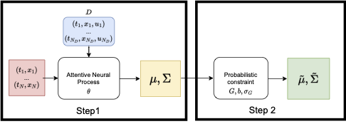
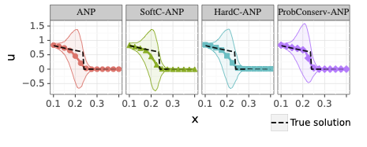
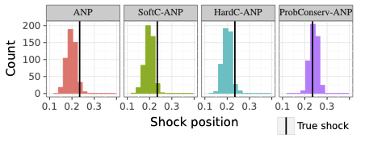
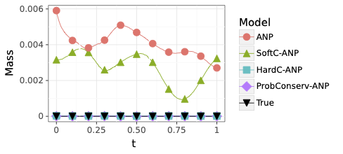

# ProbConserv: Probabilistic Framework to Enforce Conservation Laws
[](https://github.com/wemake-services/wemake-python-styleguide)



[Derek Hansen](http://www-personal.umich.edu/~dereklh/), [Danielle C. Maddix](https://scholar.google.com/citations?user=IPDByA8AAAAJ&hl=en), [Shima Alizadeh](https://scholar.google.com/citations?user=r3qS03kAAAAJ&hl=en), [Gaurav Gupta](http://guptagaurav.me/index.html), [Michael W. Mahoney](https://www.stat.berkeley.edu/~mmahoney/) \
**Learning Physical Models that Can Respect Conservation Laws**

## Installation
This project uses [poetry](https://python-poetry.org/) to manage dependencies.

From the root directory:
```
poetry install
```

Some of the plots require certain LaTeX packages are present. On Ubuntu, these are
```
sudo apt install cm-super dvipng texlive-latex-extra texlive-fonts-recommended
```

You can then use `poetry run` followed by a command, or `poetry shell` to open a shell with the correct virtual environment.

To run the tests:
```
poetry run pytest
```
The code for this project is located in the `deep_pdes` folder. It consists of two libraries, `attentive_neural_process` and  `datasets`, that comprise the models and datasets respectively.
These libraries are imported by the scripts in `experiments` that configure and run the specific case studies explored in the ProbConserv paper.
## Running experiments
The experiment code in `deep_pdes/experiment` uses [Hydra](https://hydra.cc/) to manage configuration and run experiments. The different stages of the experiments are broken into distinct commands for easier reproduceability
- `generate.py`: Generate synthetic datasets for training
- `train.py`: Train ProbConserv-ANP, ANP, and other baseline methods such as Physics-Informed Neural Networks (PINNs)
- `analyze.py`: Evaluate the trained models on test datasets and create tables/plots from the results.
- `plots.py`: Generate all plots used in the submission. Does not use the Hydra CLI but uses the compose API internally.

Each script is run by passing an `+experiments=*` flag. The available experiments can be found in `deep_pdes/experiments/conf/experiments`. For example, to recreate the results on the Stefan GPME setting:
```
EXPERIMENT=2b_stefan_var_p

python generate.py +experiments=$EXPERIMENT
python train.py +experiments=$EXPERIMENT +train=${EXPERIMENT}_anp
python train.py +experiments=$EXPERIMENT +train=${EXPERIMENT}_pinp
python analyze.py +experiments=$EXPERIMENT
```
These commands are also available in convenience scripts; for example, the above is in `deep_pdes/experiments/2b_stefan_var_p.sh`.

 \
**Solution Profiles and UQ for the Stefan Equation** \
 \
**Downstream Task: Shock location detction**

For the diffusion equation with constant diffusivity, see  `deep_pdes/experiments/3b_heat_var_c.sh`.
 \
**Conservation of mass** can be violated by the black-box deep learning models, even with applying the PDE as a soft-constraint to the loss function a la Physics informed Neural Networks (PINNs). The true mass for this diffusion equation is zero over time since there is zero net flux from the domain boundaries and mass cannot be created or destroyed on the interior.

## Sources
This repo contains modified versions of the code found in the following repos:
- `https://github.com/a1k12/characterizing-pinns-failure-modes`: For diffusion/heat equation analytical solution (MIT license)
- `https://github.com/soobinseo/Attentive-Neural-Process`: For implementation of the Attentive Neural Process (Apache 2.0 license)

